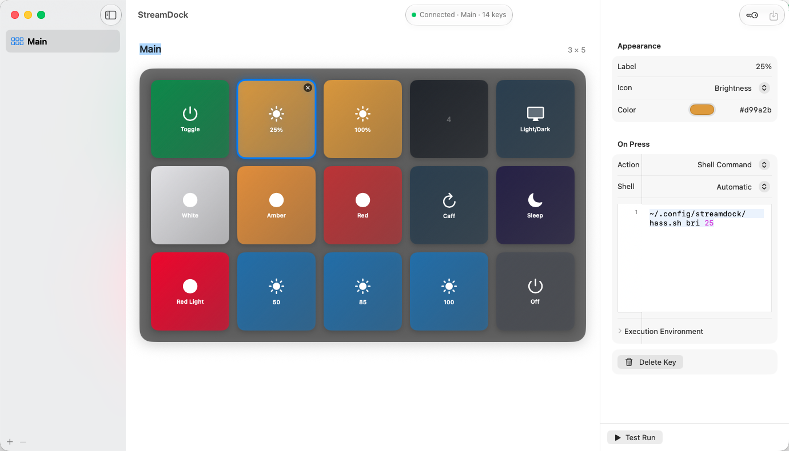

<div align="center">

# StreamDock

**A native macOS editor and runtime for MiraBox / Ajazz / HOTSPOTEK
"Stream Dock" macropads — no vendor software required.**




</div>

StreamDock talks directly to the Elgato-Stream-Deck-style macropad that
enumerates over USB as **`HOTSPOTEKUSB HID DEMO`** (`0x5548:0x1000`, sold as
VSD Inside M18 and relatives), using a community-reverse-engineered wire
protocol. A SwiftUI app is the primary editor and runtime; a userspace
**Python driver + CLI** covers diagnostics and headless use. Built and
verified on macOS (Apple Silicon).

## Highlights

- **Native editor** — 3×5 deck grid with drag-and-drop, named pages, and a
  key inspector: icons, colors, images, meter levels, live device preview.
- **Typed actions** — open apps, run shell commands, inline
  Python/Bash/Zsh/AppleScript with syntax highlighting and language
  detection, script files, page switches, deck sleep. Test-run any action
  and capture its output without touching the device.
- **Hardware paging** — the three buttons under the screen page
  previous / home / next out of the box.
- **Macros (key references)** — any key's script can press other keys and
  switch pages through a local control socket, `streamdock` helper CLI, and
  Python bridge, with loop protection.
- **Secrets** — AES-GCM-encrypted environment store backed by the login
  Keychain; commands reference `$TOKEN`, configs stay clean.
- **Runtime** — menu-bar app, launch-at-login, keep-alive, auto reconnect,
  idle screen-off, config hot-reload.
- **Phone controls** — optional local-network web server with a responsive button
  grid and page switching; no editor, configuration, or secrets are exposed.

## Quick start: build the native macOS app

The SwiftUI app is the primary way to use StreamDock. It requires macOS 14 or
newer and the full Xcode application; the Python environment and `hidapi` are
not required for the native app.

From a clone of this repository, open the project:

```bash
open macos/StreamDock.xcodeproj
```

In Xcode, select the **StreamDock** scheme and **My Mac**, then press **Run**
(`Cmd-R`). The app provides the deck editor, typed actions, app and script
pickers, captured command output, menu-bar runtime, launch-at-login, and a
native IOHID driver.

To build a Release app and install it in `/Applications` from the command line:

```bash
xcodebuild \
  -project macos/StreamDock.xcodeproj \
  -scheme StreamDock \
  -configuration Release \
  -derivedDataPath .build/xcode \
  build

ditto .build/xcode/Build/Products/Release/StreamDock.app \
  /Applications/StreamDock.app
open /Applications/StreamDock.app
```

On first launch, StreamDock imports the first existing YAML or legacy TOML
configuration it finds under `~/.config/streamdock/`. It then stores the native
configuration at `~/Library/Application Support/StreamDock/config.yaml`.

See [`macos/README.md`](macos/README.md) for native architecture and
verification details.

## Python CLI (optional)

The Python driver and CLI remain useful for hardware diagnostics, one-shot
commands, and headless operation:

```bash
uv sync
uv run streamdock info
uv run streamdock color 0 '#00c800'      # top-left key green
uv run streamdock brightness 80
uv run streamdock watch                  # stream button presses
```

The Python CLI requires the separate `hidapi` setup described below. The old
browser-based editor has been removed.

## Key references (macros)

While the macOS app is running, any key's script can **press other keys and
switch pages** — so one key can compose a macro out of existing keys. The app
hosts a local control socket; every action it launches gets a small
`streamdock` helper CLI on `PATH` and a `streamdock` Python module on
`PYTHONPATH`, both of which talk to that socket.

From a shell command or inline Bash/Zsh:

```bash
streamdock press 4                    # press position 4 on the active page
streamdock press "Amber" --page main  # press by label, on a specific page
streamdock page media                 # switch page (also: next / prev / first)
streamdock list                       # every key: page, position, label
streamdock status                     # the app's device status line
```

From inline Python:

```python
import streamdock

streamdock.key(4).press()
streamdock.press("Amber", page="main")
streamdock.switch_page("next")
print(streamdock.list_keys())
```

From AppleScript, shell out (native AppleScript actions are landing
separately):

```applescript
do shell script "streamdock press 4"
```

Key references resolve by position digits (`4`) or case-insensitive label
(`amber`); without `--page` the currently active page is used. The app injects
these variables into every action's environment:

| Variable | Meaning |
|---|---|
| `STREAMDOCK_SOCKET` | path of the app's control socket |
| `STREAMDOCK_KEY` | position of the key that launched the action |
| `STREAMDOCK_PAGE` | page that key lives on |
| `STREAMDOCK_PRESS_DEPTH` | how many chained presses deep the action is |

Chained presses carry that depth counter, and the app refuses presses at depth
**8** with `press depth limit reached (possible macro loop)` — so an accidental
A→B→A cycle fizzles out instead of forking forever.

## Python CLI installation

Needs the native **hidapi** library (the Python `hidapi` binding links against it):

```bash
brew install hidapi          # macOS
# sudo apt install libhidapi-dev   # Debian/Ubuntu (untested)
```

Then, in a clone of this repo:

```bash
uv sync
uv run streamdock info
```

`uv run` locates `libhidapi` for you (via `brew --prefix` / common paths), so you
do **not** need to export `DYLD_LIBRARY_PATH`.

## CLI

`uv run streamdock <command>`:

| Command | Description |
|---|---|
| `run [config]` | **run the control loop** from a config file (see below) |
| `install-agent` | install+start a macOS LaunchAgent that runs the loop at login |
| `uninstall-agent` | stop and remove that LaunchAgent |
| `agent-status` | show whether the LaunchAgent is loaded / running |
| `info` | device info + firmware + a map of the physical layout |
| `brightness <0-100>` | set screen brightness |
| `color <pos> <#rrggbb\|r,g,b>` | solid-color a key by reading-order position |
| `image <pos> <path>` | draw an image file onto a key |
| `clear [<pos>] [--all]` | clear one key or all keys |
| `identify` | draw each key's position number on its screen |
| `rainbow` | paint all LCD keys (demo) |
| `watch` | stream button events (`position down/up`) until Ctrl-C |
| `version` | print version |

`pos` is a **reading-order position**: `0` = top-left, increasing left-to-right,
top-to-bottom. All commands accept `--vid` / `--pid` to target other units.

## Control loop (`streamdock run`)

The one-shot commands draw a key and exit — and this firmware **reverts to its
onboard kiosk/screensaver image the moment nothing is talking to it.** To use
the deck as a real control surface you run the persistent control loop, which
renders your buttons, dispatches presses to commands, and sends a periodic
keep-alive so it never drops back to kiosk mode (it also auto-reconnects if you
unplug/replug).

```bash
uv run streamdock run mydeck.yaml
# or drop a config at ~/.config/streamdock/config.yaml and just: streamdock run
```

Config is YAML — keys live on named **pages**, and each key maps a position to
a look and an action:

```yaml
settings:
  brightness: 80
  keepalive_seconds: 2.0
  # env_file: secrets.env     # optional KEY=VALUE file loaded into the command env

pages:
  - name: main
    keys:
      # app: opens a macOS app on press (sugar for: open -a "Terminal")
      - {position: 0, label: Term, icon: monitor, color: '#1e6ea0', app: Terminal}
      # command: any raw shell command
      - {position: 1, label: Build, icon: play, command: "make -C ~/proj build"}
      # meter icons fill to `level` (or to the number in the label: "75%" -> 0.75)
      - {position: 2, label: "75%", icon: brightness, color: '#d99a2b',
         command: "curl -s -X POST $HA_URL -H \"Authorization: Bearer $HA_TOKEN\" ..."}
      # or supply your own image; overrides icon/label
      - {position: 3, image: icons/custom.png, command: "..."}
      # action: switch pages — "page:next" / "page:prev" (wrap), "page:first",
      # or "page:<name>"
      - {position: 14, label: Media, icon: cycle, action: 'page:next'}

  - name: media
    keys:
      - {position: 0, label: Play, icon: play,
         command: "osascript -e 'tell application \"Music\" to playpause'"}
      - {position: 14, label: Main, icon: cycle, action: 'page:main'}
```

Per key: `label`, `icon`, `color`, `image`, `level` control the look; `app`
(open a macOS app), `command` (raw shell), and `action` (`sleep`,
`page:next`/`page:prev`/`page:first`/`page:<name>`) control what a press does.
Pressing a page key re-renders the whole deck with that page's keys.

The three **hardware buttons under the screen** page by default — left =
previous page, middle = first page, right = next page. Configure a key at
position `15`, `16`, or `17` to override one of them.

The loop also **hot-reloads the config**: edit and save the file and the deck
re-renders within ~2s — no restart. A half-written or invalid file is ignored
and the previous config stays active.

**Legacy TOML configs keep working**: a flat `[[keys]]` TOML file (see
`streamdock.toml` in the repo) loads as a single page named `main`. YAML is the
canonical format going forward (`streamdock run` prefers `streamdock.yaml`,
then `streamdock.toml`, then the same names under `~/.config/streamdock/`).

### Key rendering

Keys are drawn with a subtle gradient (derived from `color`), real typography,
auto-contrast text, rounded "button" corners, and clean vector icons rendered at
4× supersampling. Built-in icons (`streamdock icons`):

```
brightness  bulb  contrast  cycle  dot  droplet  gear  lock  meter
minus  monitor  moon  play  plus  power  refresh  sun
```

`brightness`/`meter`/`contrast` show a fill level — set `level = 0..1`, or just
put a number in the label (`"75%"` → 75% full). Prefer an image? Set `image` to
any file and it's used as-is.

Because presses run **arbitrary shell commands**, a key can do anything the host
can — launch apps, run scripts, call `osascript`/`pmset`, hit HTTP APIs, etc.
Keep secrets out of the config with `env_file` (values are loaded into the
environment, so commands reference `$TOKEN` instead of hardcoding it).

### Sleep key

A key with `action = "sleep"` puts the deck's **displays to sleep** (panel off).
Pressing **any** key afterwards wakes it and redraws everything (that first press
only wakes — it doesn't fire its own command). If the sleep key also has a
`command`, it runs on the way down (e.g. dim your room lights too).

```yaml
- {position: 9, label: Sleep, icon: moon, action: sleep}
```

### Run at login + menu bar (macOS)

To make the loop a permanent replacement for the vendor software, install it as
a LaunchAgent — it starts at login, relaunches itself if it exits, and shows a
**🎛 menu bar icon** so you can see the daemon is running:

```bash
uv run streamdock install-agent            # uses ~/.config/streamdock/config.yaml (or .toml)
uv run streamdock agent-status             # loaded? running? pid?
uv run streamdock uninstall-agent          # stop + remove
```

Pass `--no-menubar` to `install-agent` to run headless, or `run --menubar` to
show the icon when running by hand. This writes
`~/Library/LaunchAgents/com.streamdock.run.plist` (logs to
`~/.config/streamdock/agent.log`). The agent runs the installed `streamdock`
executable directly, so it needs no terminal open.

## Library

The CLI is a thin wrapper over the same public API:

```python
from streamdock import StreamDock

with StreamDock() as sd:
    sd.initialize()                          # REQUIRED: software mode + handshake
    print(sd.firmware_version())
    sd.set_brightness(80)

    sd.set_position_color(0, (0, 200, 0))    # top-left key green
    sd.set_position_image(4, "icon.png")     # image file / PIL.Image / bytes
    sd.set_position_color(14, (255, 0, 0))   # bottom-right key red

    while True:
        ev = sd.read_position(timeout_ms=500)   # (position, is_down) | None
        if ev:
            pos, down = ev
            print(pos, "down" if down else "up")
```

Lower-level helpers (`set_slot_color`, `set_slot_image`, `read_key`, `set_mode`,
`clear_slot`) are available if you want raw device ids instead of positions.

## Physical layout (this unit)

**15 keys** in a 3×5 grid, all with LCD screens, plus **3 screenless buttons**
below the screen:

```
 0   1   2   3   4      key_id 1-5,   image slots 11-15
 5   6   7   8   9      key_id 6-10,  image slots 6-10
10  11  12  13  14      key_id 11-15, image slots 1-5
    15  16  17          key_id 0x25 / 0x30 / 0x31, no screens
```

- Grid `key_id`s are already reading-order (`key_id = position + 1`); image
  *slots* are not, so the driver's `Layout.position_to_slot` handles the remap.
- The three bottom buttons report vendor key ids `0x25`/`0x30`/`0x31`
  (left→right, captured on hardware) and map to positions **15/16/17**. Both
  runtimes bind them to paging by default — **left = previous page, middle =
  first page, right = next page** — and a configured key at one of those
  positions overrides the default (they can run commands, just never draw).
- The `Layout` type also supports screenless keys inside the grid
  (`slot = None`) for other models; this unit just happens to have a screen on
  every grid key.

Other models require a `DeviceProfile` containing both their `Layout` and exact
key-image size; pass it as `StreamDock(..., profile=profile)`. Unknown USB IDs
are deliberately rejected instead of borrowing another model's geometry.

## How it talks (the reverse-engineering notes)

- **Transport is hidapi, not libusb.** On macOS `IOHIDFamily` claims interface 0,
  so `libusb`/`pyusb` can't `claim_interface` it (`Access denied`). Going through
  the OS HID stack sidesteps that.
- **Open interface 0 by usage page `0xFFA0`** (both HID interfaces share VID:PID;
  interface 1 is a fake keyboard).
- **Packets are 1024 bytes** (protocol v3). Reports shorter than 1024 are silently
  ignored — the single most confusing gotcha.
- **Switch to Software mode first** (`MOD` = `3`). The device boots emulating a
  keyboard and won't report presses on interface 0 until switched. `initialize()`
  does this, then the `DIS` + `LIG` handshake.

### Command framing

Every command is `CRT\x00\x00` (`43 52 54 00 00`) + verb + payload, padded to 1024:

| Verb | Bytes | Meaning |
|---|---|---|
| `MOD` | `4d 4f 44 00 00 <0x30+mode>` | mode (1=keyboard, 2=calc, 3=software) |
| `DIS` | `44 49 53 00 00` | wake / display on |
| `LIG` | `4c 49 47 00 00 <0..100>` | brightness percent |
| `CLE` | `43 4c 45 00 00 00 <target>` | clear (`0xff`=all, or a slot id) |
| `BAT` | `42 41 54 <len:u32 BE> <slot>` | begin image; stream JPEG in 1024-byte reports |
| `STP` | `53 54 50 00 00` | flush / commit pending image |

For the default VSD Inside M18 / HOTSPOTEK `0x5548:0x1000` profile, each key
image is a **64×64 JPEG**. Button input reports are framed
`41 43 4b 00 00  4f 4b 00 00  <key_id> <state>` (`ACK…OK…`), key id at byte 9,
state at byte 10 (`1`=press, `0`=release; both edges reported).

## Credits / prior art

The wire protocol was reverse-engineered by the community — this project ports it
to Python and adds the macOS transport handling + layout calibration:

- [4ndv/mirajazz](https://github.com/4ndv/mirajazz) — Rust lib; source of the
  command framing, the mode enum, and protocol-v3 details.
- [ibanks42/opendeck-m18](https://github.com/ibanks42/opendeck-m18) — OpenDeck
  plugin for the M18 family; independently confirms the bottom-button key ids
  `0x25`/`0x30`/`0x31` (left/middle/right).
- [rigor789/mirabox-streamdock-node](https://github.com/rigor789/mirabox-streamdock-node)
- [Uriziel01/Ajazz-AKP153-reverse-engineering](https://github.com/Uriziel01/Ajazz-AKP153-reverse-engineering)

## License

MIT — see [LICENSE](LICENSE).
